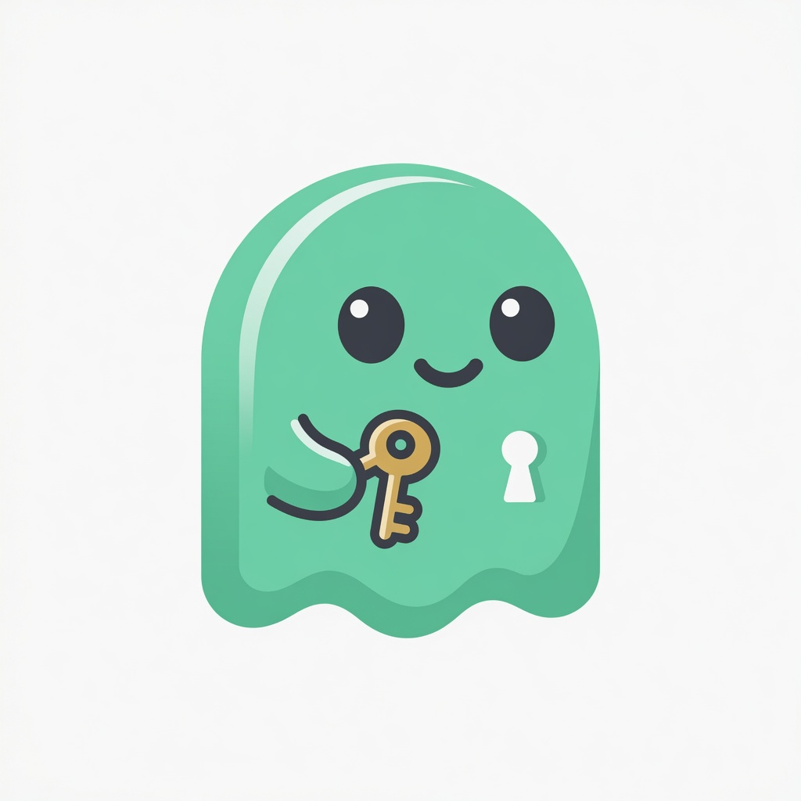

# GhostKeys

<p align="center">
  
</p>

<p align="center">
  <strong>Your authenticator, tied to your wallet, not your phone.</strong>
</p>

GhostKeys is a wallet-backed authenticator on **Monad**. Save 2FA accounts once, unlock them on any device by connecting the same wallet, and copy time-based codes when you need them.

## Try it locally

```bash
cd web
cp .env.example .env
npm install
npm run dev
```

Then open:

| Page | URL |
|------|-----|
| Landing | http://localhost:4321 |
| App | http://localhost:4321/app |

`.env.example` already points at the deployed testnet vault. You only need to change it if you redeploy.

## Deployed contract (Monad Testnet)

| | |
|--|--|
| Address | [`0xF4c908b91876a3fa839c1457f4eEfD119ED6901C`](https://testnet.monadvision.com/address/0xF4c908b91876a3fa839c1457f4eEfD119ED6901C) |
| Chain ID | `10143` |
| RPC | `https://testnet-rpc.monad.xyz` |

## How it works

1. Connect your wallet on Monad.
2. Sign to unlock (bound to this site, network, wallet, and vault). No gas for unlock.
3. Add a 2FA setup key. Encryption happens in the browser.
4. Encrypted data is stored on Monad. Codes are generated on your device.

## Project layout

```
web/         Landing + app (Astro, React, HeroUI)
contracts/   SecretVault (Foundry)
```

### Redeploy contracts (optional)

```bash
cd contracts
forge install foundry-rs/forge-std
forge test --match-contract SecretVaultTest
forge script script/DeploySecretVault.s.sol:DeploySecretVault \
  --rpc-url https://testnet-rpc.monad.xyz \
  --broadcast \
  --private-key $PRIVATE_KEY
```

Then put the new address in `web/.env` as `PUBLIC_VAULT_ADDRESS`.

## Security

- Unlock is bound to site origin, chain, wallet, and vault address.
- Unlock session stays in the browser tab until you lock, refresh, or switch wallet.
- Prefer demo or low-risk accounts on testnet.
- Not a formal security audit.

## License

MIT
